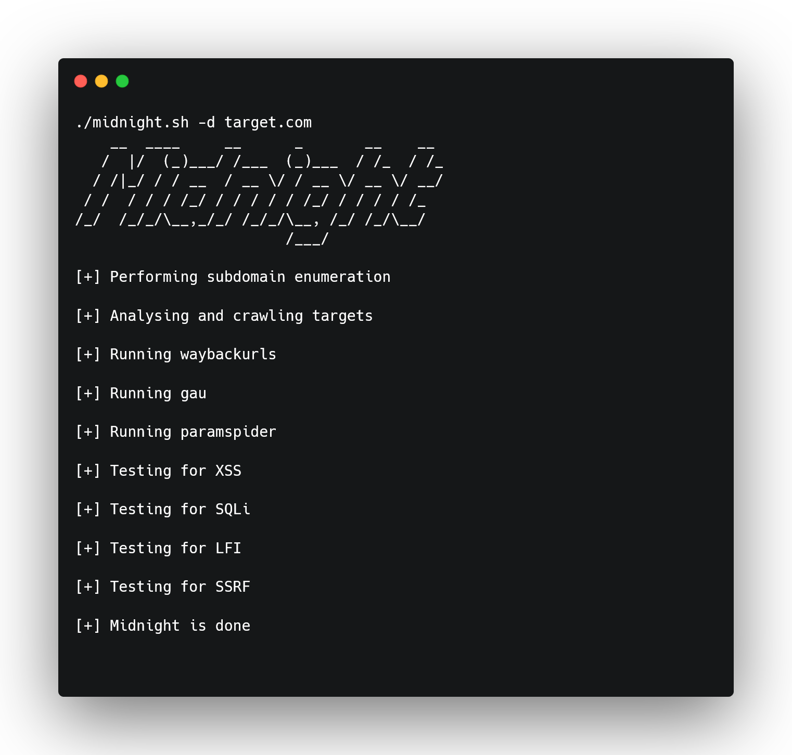

<h1 align="center">
  
 </h1>

<h2>Introducing Midnight</h2>
<h3>Your bug bounty companion for thrilling midnight discoveries!</h3>
<h1 align="center">
  
</h1>

Are you ready to embark on a journey into the hidden realms of the web? Say hello to Midnight, the bug bounty tool that promises to keep you wide awake with pulse-quickening finds that emerge under the cover of darkness.

Unveil the secrets that lie within your target domain with Midnight, armed with its formidable arsenal: it is your gateway to a world of vulnerability hunting like never before. 

**Cross-Site Scripting** (XSS), **SQL Injection** (SQLi), **Server-Side Request Forgery** (SSRF) and **Local File Inclusion** (LFI) - Midnight tackles them all and it's only a domain away.

Gone are the days of sifting through endless lines of code and URLs, Midnight does the heavy lifting for you! 

Just feed it the target domain and watch as it unearths the ghosts of URLs past, meticulously collected from the depths of the digital archives; but Midnight doesn't stop there, it goes beyond just gathering relics; it tests each one, ensuring that no stone is left unturned!

Imagine being the first to know about a new asset within your scope or a fresh target that's ripe for exploration, that's where Midnight truly shines; the moment you receive a notification, seize the opportunity! 

Run Midnight and be prepared to gain a head start like never before; let it accompany you through the dark corners of the web, revealing vulnerabilities that would otherwise remain hidden. 

Unveil the mysteries of the past, and illuminate the path to a safer digital world.

So, are you ready to welcome Midnight into your bug bounty arsenal? 

Brace yourself for late-night revelations, adrenaline-pumping discoveries and the satisfaction of staying one step ahead in the exhilarating world of cybersecurity. 

The night is young, and Midnight is your beacon of enlightenment.

<h2>Requirements</h2>

These tools are required to run midnight and have it notify you of any vulnerabilities it uncovers:

**Project Discovery tools**: subfinder, interactsh, httpx, katana, notify

**waybackurls**

**gau**

**paramspider**

**uro**

**qsreplace**
<br>
<br>
<h2>Installation</h2>

```bash
git clone https://github.com/DomenicoVeneziano/Midnight.git ; cd Midnight; sudo chmod +x ./midnight.sh
```

<h2>Usage</h2>

**Midnight** can be used either with a **single domain** or with a **list** of **targets** recursively

```bash
./midnight -d [target domain]
```

```bash
./midnight -l [targets list]
```

Both **xsspayloads** and **LFIpayloads** can be **customized** and **modified** to suit your needs. 

<h2>Acknowledgments</h2>

* [sp1nn4k3r](https://github.com/sp1nn4k3r), mentor and friend
* [Project Discovery](https://github.com/projectdiscovery), [tomnomnom](https://github.com/tomnomnom), [Corben Leo](https://github.com/lc), [Somdev Sangwan](https://github.com/s0md3v), [Devansh Batham](https://github.com/devanshbatham) and [Jason Haddix](https://github.com/jhaddix) for their awesome tools and for making my bug bounty hunting journey better